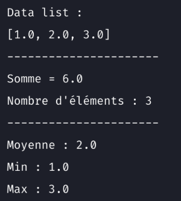

# Familiarisation avec les commandes de git 

Supposons que vous devez développer une application en Python qui permet d'afficher quelques paramètres statistiques sur base d'une liste de données.

## Données
Les données seront codées en dur dans l'application sous la forme d'une liste de réels.

## Fonctionnalité 1 : Calculer la Somme
L'application permettra d'afficher la somme et le nombre d'éléments de la liste.

## Fonctionnalité 2 : Calculer les paramètres de position
L'application permettra d'afficher les statistiques suivantes :
* moyenne
* valeur minimum
* valeur maximum
## Exécuter l'application

```shell
python3 main.py
```
## Capture d'écran de l'application
